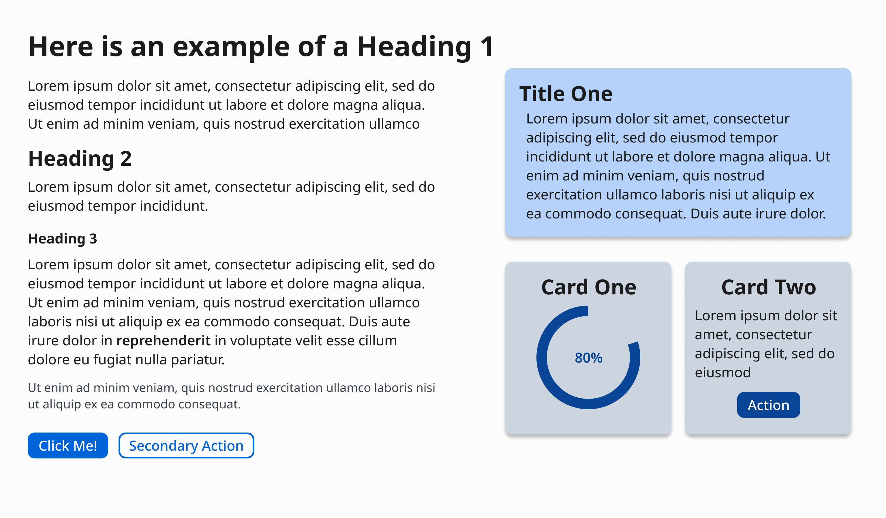
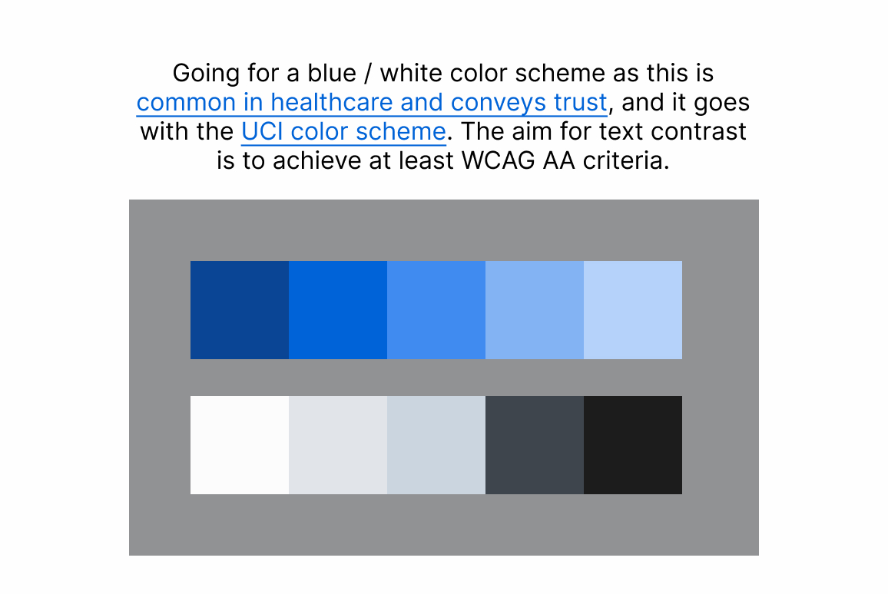
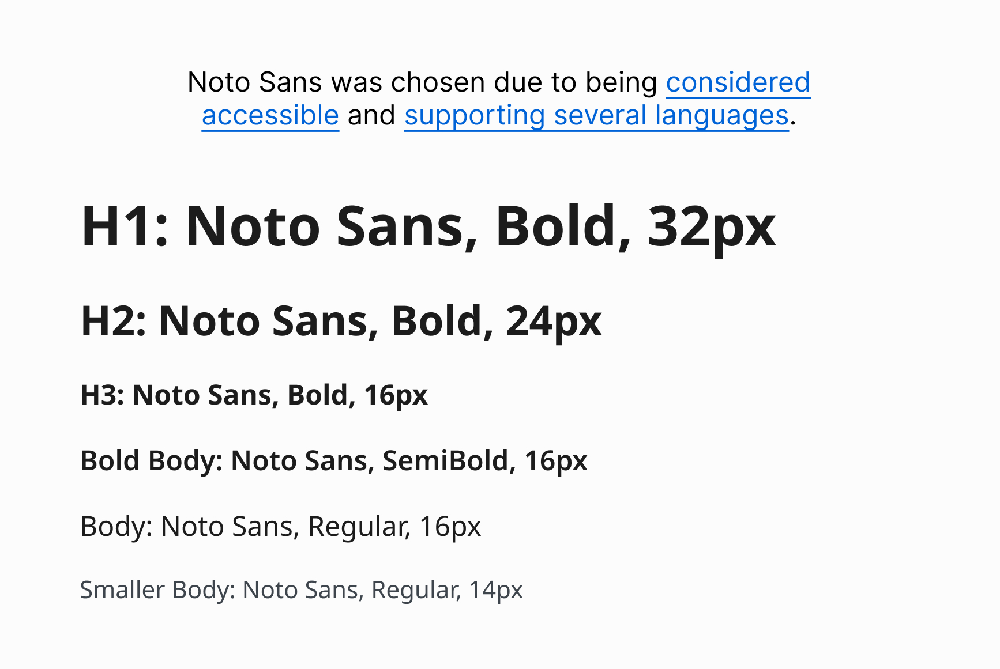

# Iris Branding Guide

This document exists to establish a branding guide for the Iris project. Please
read this document to its fullest and make sure you know where you can find
pre-made components for your frontend.

Original guide was created by [@jessed7](https://github.com/jessed7).

## Colors

We're going for a blue/white color scheme as this is
[common in healthcare and conveys trust](https://doctorlogic.com/blog/medical-logo-colors),
and it goes with the
[UCI color scheme](https://brand.uci.edu/master-branding/color-palette/). The
aim for text contrast is to at least WCAG AA criteria.

Color codes:

- `#094595` (Dark Blue)
- `#0063D7` (Primary Blue)
- `#3F8BF0`
- `#83B3F3` (Light Blue)
- `#B4D2F9`
- `#FCFCFC`
- `#E1E4E9`
- `#CBD5E0`
- `#3E454D`
- `#1C1C1C`

## Fonts

Noto Sans was chosen due to being
[considered accessible](https://www.audioeye.com/post/accessible-fonts/) and
[supporting several languages](https://typogram.co/font-discovery/how-to-use-noto-sans-font).

## Buttons

| Button type | Description            | Component location                                        |
| ----------- | ---------------------- | --------------------------------------------------------- |
| Primary     | Blue fill              | [Button.tsx](/src/app/core/components/Button.tsx)         |
| Secondary   | Blue outline           | [Button.tsx](/src/app/core/components/Button.tsx)         |
| Back        | An arrow pointing left | [BackButton.tsx](/src/app/core/components/BackButton.tsx) |
