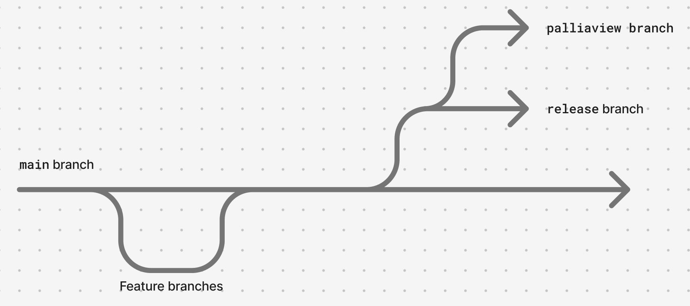

# Palliaview Support

Ojos Project started as a research project at UC Irvine, and part of our
proposal included two components: software and hardware. The software component
is the Iris software, and the hardware component is Palliaview.

Palliaview is powered by the Iris software; however, it also provides a seamless
software-hardware experience. Thus, Palliaview will be receiving first class
support from the Iris developers.

## `palliaview` branch



Iris developers are going to be maintaining a `palliaview` branch in the
repository. It will branch off of `release`, but it will include
Palliaview-specific settings that are not included in the GitHub releases.

The GitHub releases of the Iris software are meant to be installed on any
general Windows, macOS, and Linux device. They'll likely need be configured
(such as importing Data Packs) before all features can be used. The `palliaview`
branch will have this content preloaded, removing the need to configure settings
before using the software.

## Compiling from source

> [!WARNING]
> Palliaview devices should not be using the GitHub releases of Iris software.
> Instead, they should compile the source code from the `palliaview` branch.

To compile from source, you must setup the project according to the
[contributing guide](../../CONTRIBUTING.md). Then, you can run the following
commands:

```shell
git clone https://github.com/ojosproject/iris/
cd iris
git pull origin main # update local main
git switch palliaview
git pull origin palliaview # update local palliaview
# git merge main # only do this if you want to test pre-release stuff

nvm use
npm i
cargo tauri build
```

This will build an executable. We recommend using the Debian output. These
executables will not have auto-updates enabled.
