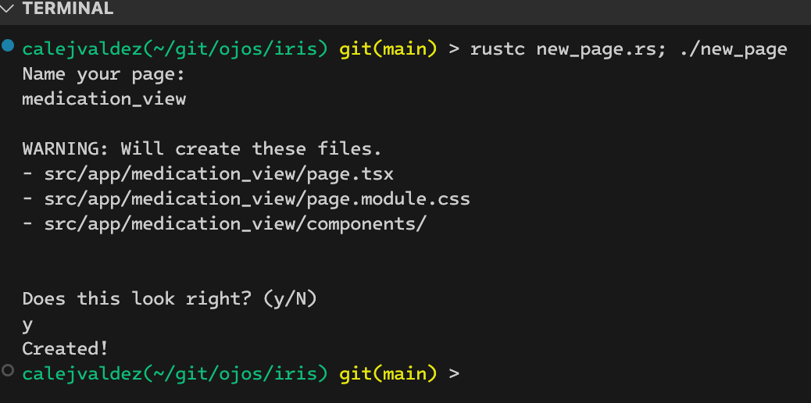

# Using the `new_page.rs` tool


In the root of the repository, there's a `new_page.rs` file. This file is for
the frontend developers to keep a consistent creation of new pages.

## Compiling

Before you can use it, you need to compile it. You can both compile and run
the program using this line:

```shell
rustc new_page.rs; ./new_page
```

## Usage



## Source Code

[View here.](../new_page.rs)
